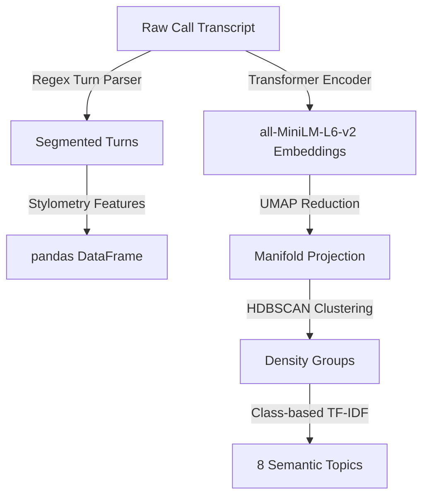

# Conversation Pattern Miner — NLP Methodologies & Testing Architecture

This document describes the core NLP methodologies, algorithms, and validation testing architecture used throughout the framework.

---

## 1. Testing Architecture: Pytest vs. Pylance

To ensure code quality and runtime correctness, the workspace separates **static code checking** from **dynamic runtime execution validation**:

- **Pylance (Static Checking)**: Runs in the background of the IDE. It performs static analysis (without executing the python code) to check syntax, detect broken imports (such as missing site-packages like `pydantic` or `yaml`), highlight type discrepancies, and provide IntelliSense autocompletions.
- **Pytest (Dynamic Unit Testing)**: A dynamic testing library that executes scripts in the `tests/` directory. It uses mock inputs, executes function code paths, and asserts that the computed objects match our expected data schemas.

### Implemented Test Suites
Our tests verify each component of the pipeline:
1. **`test_loader.py`**: Ensures the ingestion loader correctly parses standard JSON arrays and line-delimited JSONL formats, and handles file anomalies.
2. **`test_validator.py`**: Verifies that raw record dictionaries are filtered against Pydantic schema constraints and validates that outcome labels fall within acceptable ranges.
3. **`test_profiler.py`**: Asserts that profile summary statistics are computed correctly and checks that PDF/EDA visualization images are exported.
4. **`test_features.py`**: Feeds transcripts containing specific turn structures and validates that text features (like question marks and consecutive speaker monologues) are calculated accurately.
5. **`test_topics.py`**: Fits a lightweight `BERTopic` wrapper on a mock corpus and confirms that topic definitions are successfully exported to a JSON dictionary.

---

## 2. Core NLP Methodologies

### Ingestion Schema Validation
- **Methodology**: **Data Sanitization and Structural Constraints**.
- Parsing textual transcripts in bulk requires strict structural integrity. Pydantic models define types (e.g. integer bounds on turn counts, float bounds on talk ratios) to filter corrupted records prior to vector encoding.

### Regex Segmenter (Transcript Cleaner)
- **Methodology**: **Dialogue Turn Segmentation**.
- Call summaries are stored as single-string paragraphs with custom turn delimiters (` | `). We parse these using regular expressions:
  `r"^\[(T\d+)\]\s+([^:]+):\s*\"?(.*?)\"?$"`
  This separates the string into structured turns containing speaker metadata (Agent/Customer) and raw speech blocks.

### Conversational Features Extractor
- **Methodology**: **Stylometry & Conversational Dynamics**.
- Translates conversational behaviors into numerical features:
  - *Talk Ratio*: Measures conversational dominance.
  - *Question Frequencies*: Indicates agent discovery questions and customer engagement.
  - *Max Monologue*: Detects scripting rigidity and lack of interaction.

### Semantic Call Embeddings
- **Methodology**: **Dense Vector Embeddings (Sentence Transformers)**.
- TF-IDF or Bag-of-Words count exact words but fail on synonyms (e.g., matching "cheap" with "inexpensive"). We utilize the **Transformer-based** `all-MiniLM-L6-v2` encoder (a distilled BERT model) to project transcript summaries into a continuous **384-dimensional vector space**, mapping context and semantics rather than lexical tokens.

### Topic Modeling (BERTopic)
- **Methodology**: **Unsupervised Topic Discovery & c-TF-IDF**.
  - **UMAP (Uniform Manifold Approximation & Projection)**: Projecting high-dimensional embeddings (384D) directly for clustering causes distance distortions. UMAP reduces dimensions while preserving local neighborhood similarities.
  - **HDBSCAN (Hierarchical Density-Based Spatial Clustering)**: Automatically discovers semantic clusters in the projection space, filtering noise into Topic `-1`.
  - **c-TF-IDF (Class-based TF-IDF)**: Extracts the top words that uniquely describe each topic by treating all calls in a topic as a single document.
  - **Topic Reduction**: Semantically groups topics together until exactly **8 topics** remain.
